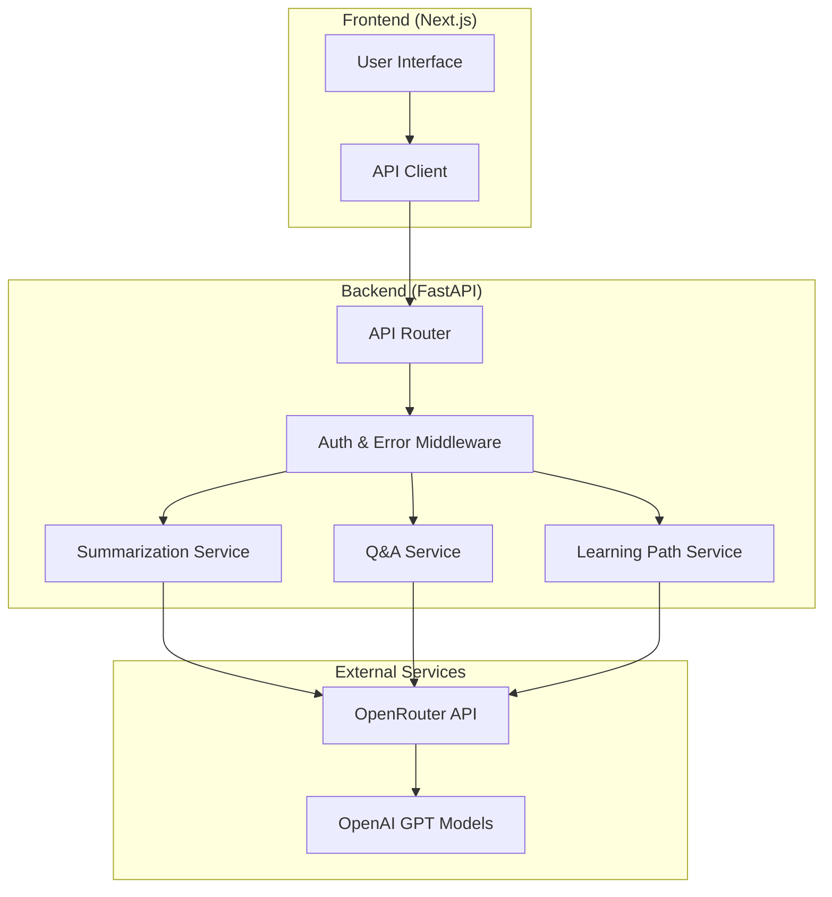

# Design Document

## Overview

The AI Microservices application will be built using a modern full-stack architecture with FastAPI as the backend framework and Next.js for the frontend. The system will integrate with OpenAI's API through OpenRouter to provide three core AI functionalities: text summarization, document Q&A, and dynamic learning path generation.

The architecture follows microservices principles with clear separation of concerns, making each AI service independently deployable and scalable. The backend will expose RESTful APIs with comprehensive documentation, while the frontend will provide an intuitive interface for testing and demonstrating the capabilities.

## Architecture

### System Architecture



### Technology Stack

**Backend:**
- FastAPI: Modern, fast web framework for building APIs
- Pydantic: Data validation and settings management
- python-multipart: For file upload handling
- httpx: Async HTTP client for OpenRouter integration
- python-dotenv: Environment variable management

**Frontend:**
- Next.js 14: React framework with App Router
- TypeScript: Type safety and better developer experience
- Tailwind CSS: Utility-first CSS framework
- Axios: HTTP client for API communication

**External Integration:**
- OpenRouter: Proxy service for OpenAI API access
- OpenAI GPT-4: Large language model for AI operations

## Components and Interfaces

### Backend Components

#### 1. API Router (`main.py`)
- Central FastAPI application instance
- Route registration and middleware setup
- CORS configuration for frontend integration
- Health check endpoints

#### 2. Service Layer
Each AI service will be implemented as a separate module:

**Summarization Service (`services/summarization.py`)**
```python
class SummarizationService:
    async def summarize_text(self, text: str, max_length: int = 150) -> str
    async def chunk_and_summarize(self, text: str) -> str
```

**Q&A Service (`services/qa.py`)**
```python
class QAService:
    async def answer_question(self, document: str, question: str) -> str
    async def process_document(self, file_content: bytes, file_type: str) -> str
```

**Learning Path Service (`services/learning_path.py`)**
```python
class LearningPathService:
    async def generate_path(self, goals: str, skill_level: str, duration: str) -> dict
    async def create_structured_path(self, raw_response: str) -> dict
```

#### 3. OpenRouter Client (`clients/openrouter.py`)
```python
class OpenRouterClient:
    async def chat_completion(self, messages: list, model: str = "openai/gpt-4") -> str
    async def handle_rate_limits(self, response) -> None
```

#### 4. Models (`models/`)
Pydantic models for request/response validation:
- `SummarizationRequest`, `SummarizationResponse`
- `QARequest`, `QAResponse`
- `LearningPathRequest`, `LearningPathResponse`

### Frontend Components

#### 1. Layout and Navigation
- Main layout component with navigation
- Responsive design for mobile and desktop
- Service selection interface

#### 2. Service Components
**Summarization Interface (`components/Summarization.tsx`)**
- Text input area with character count
- Summarization options (length, style)
- Results display with copy functionality

**Q&A Interface (`components/QA.tsx`)**
- File upload component for documents
- Question input field
- Answer display with source highlighting

**Learning Path Interface (`components/LearningPath.tsx`)**
- Form for goals, skill level, and duration
- Interactive path visualization
- Progress tracking capabilities

#### 3. Shared Components
- Loading spinners and progress indicators
- Error message displays
- API response formatters

## Data Models

### Request Models

```python
class SummarizationRequest(BaseModel):
    text: str = Field(..., min_length=10, max_length=10000)
    max_length: Optional[int] = Field(150, ge=50, le=500)
    style: Optional[str] = Field("concise", regex="^(concise|detailed|bullet-points)$")

class QARequest(BaseModel):
    question: str = Field(..., min_length=5, max_length=500)
    document_text: Optional[str] = None
    
class LearningPathRequest(BaseModel):
    goals: str = Field(..., min_length=10, max_length=1000)
    skill_level: str = Field(..., regex="^(beginner|intermediate|advanced)$")
    duration: str = Field(..., regex="^(1-week|1-month|3-months|6-months)$")
    focus_areas: Optional[List[str]] = []
```

### Response Models

```python
class SummarizationResponse(BaseModel):
    summary: str
    original_length: int
    summary_length: int
    compression_ratio: float

class QAResponse(BaseModel):
    answer: str
    confidence: Optional[float]
    sources: Optional[List[str]]

class LearningPathResponse(BaseModel):
    title: str
    duration: str
    skill_level: str
    phases: List[LearningPhase]
    resources: List[Resource]
    
class LearningPhase(BaseModel):
    phase_number: int
    title: str
    description: str
    duration: str
    objectives: List[str]
    activities: List[str]
```

## Error Handling

### Backend Error Handling

1. **Custom Exception Classes**
   - `OpenRouterAPIError`: For API communication issues
   - `DocumentProcessingError`: For file processing failures
   - `ValidationError`: For input validation failures

2. **Global Exception Handler**
   - Standardized error response format
   - Logging for debugging and monitoring
   - Rate limit handling with retry logic

3. **Input Validation**
   - Pydantic model validation
   - File type and size restrictions
   - Content length limitations

### Frontend Error Handling

1. **API Error Handling**
   - Network error detection and retry
   - User-friendly error messages
   - Fallback UI states

2. **Form Validation**
   - Real-time input validation
   - Clear error messaging
   - Accessibility considerations

## Testing Strategy

### Backend Testing

1. **Unit Tests**
   - Service layer testing with mocked OpenRouter calls
   - Model validation testing
   - Utility function testing

2. **Integration Tests**
   - End-to-end API testing
   - OpenRouter integration testing (with test API keys)
   - File upload and processing testing

3. **Performance Tests**
   - Load testing for concurrent requests
   - Memory usage monitoring for large documents
   - Response time benchmarking

### Frontend Testing

1. **Component Tests**
   - React component rendering tests
   - User interaction testing
   - Form submission testing

2. **Integration Tests**
   - API integration testing
   - File upload functionality
   - Error state handling

### Test Data and Mocking

- Mock OpenRouter responses for consistent testing
- Sample documents for Q&A testing
- Predefined learning scenarios for path generation
- Performance benchmarking datasets

## Security Considerations

1. **API Key Management**
   - Environment variable storage
   - No client-side exposure of API keys
   - Rotation and monitoring capabilities

2. **Input Sanitization**
   - File upload restrictions
   - Content filtering for malicious inputs
   - Rate limiting per client

3. **CORS Configuration**
   - Restricted origins for production
   - Proper headers for security

## Deployment Architecture

### Development Environment
- Local FastAPI server with hot reload
- Next.js development server
- Environment variable management

### Production Considerations
- Docker containerization for both services
- Reverse proxy configuration
- Environment-specific configurations
- Monitoring and logging setup